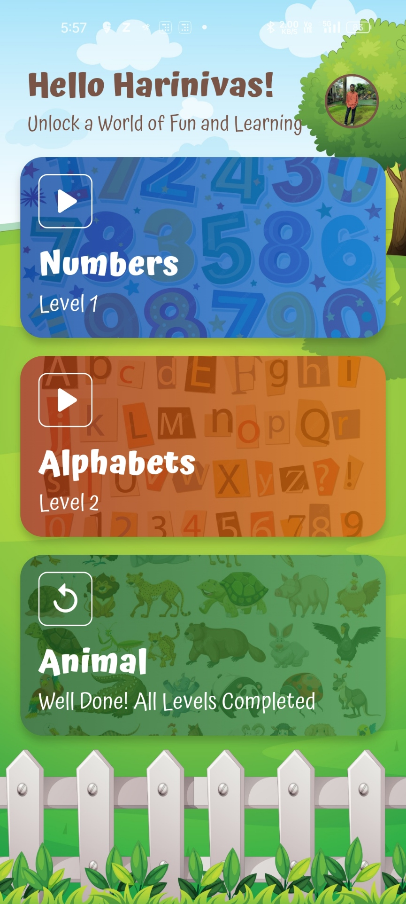

# Funfinity
KidsPlay is an engaging app designed for children. It offers a fun and interactive environment for learning and playing through educational games and activities. It aims to enhance cognitive skills, creativity, and learning in a playful way. KidsPlay is a fun and interactive kids game designed to help children learn through engaging animations and challenges. The game features categories like animal recognition, number equations, and object recognition using alphabets. New categories and levels can be added dynamically in future updates.

## Project Overview and APK Download

For a detailed project overview, please refer to the following video: [Project Overview](https://drive.google.com/file/d/1E1cf3zbOBlKrB8UJd0mYd8BqGURZX3c4/view?usp=sharing).

To download the APK, use the following link: [APK Download](https://drive.google.com/file/d/1Iq05eZN8b6Npda7qYZUdopUUVY_92NUS/view?usp=sharing). Note that some levels and categories are yet to be added.

## Features
- **Interactive Animations and Elements**: Fun and engaging animations, music, vibration and sound effects to help kids learn interactively.
- **Categories**:
  - **Animals**: Kids recognize the name of various animals.
  - **Numbers**: Kids calculate simple math equations.
  - **Alphabets**: Kids recognize objects and their corresponding alphabet.
- **Dynamic Game Structure**: The game categories and levels are stored in Firebase. Categories and levels can be added and shown in the app instantly with no UI updates.
- **Offline Play**: The game can be played offline, ensuring accessibility anytime and anywhere.
- **Real-time Bug Tracking**: Integrated with Firebase Crashlytics, Analytics, and Performance Monitoring to log real-time bugs and performance metrics for future debugging and updates.

## Technologies Used
- **Flutter**: Framework used for building the frontend of the game.
- **BLoC (Business Logic Component)**: State management solution used to manage the app's state efficiently and separate the business logic from the UI.
- **Firebase**: Used for storing data such as user progress, scores, and real-time logs.
- **Hive**: Flutter package for local storage of game categories and levels.
- **Firebase Crashlytics**: For logging real-time crashes and errors.
- **Firebase Analytics**: For tracking user interactions and app usage.
- **Firebase Performance Monitoring**: To monitor the performance of the app in real time.
- **Lottie Animations**: To show animated pictures of animals and objects.

## Screenshots
Below are some of the screenshots of the app:

| Screen                                | Screenshot                                           |
|---------------------------------------|------------------------------------------------------|
| **Splash Screen**                     |     |
| **Home Page**                         |             |
| **Menu Page**                         |             |
| **Number Level Page**                 |  |
| **Animal Level Page**                 |  |
| **Alphabet Level Page**               |  |
| **Category Completed Successfully Page** |  |

